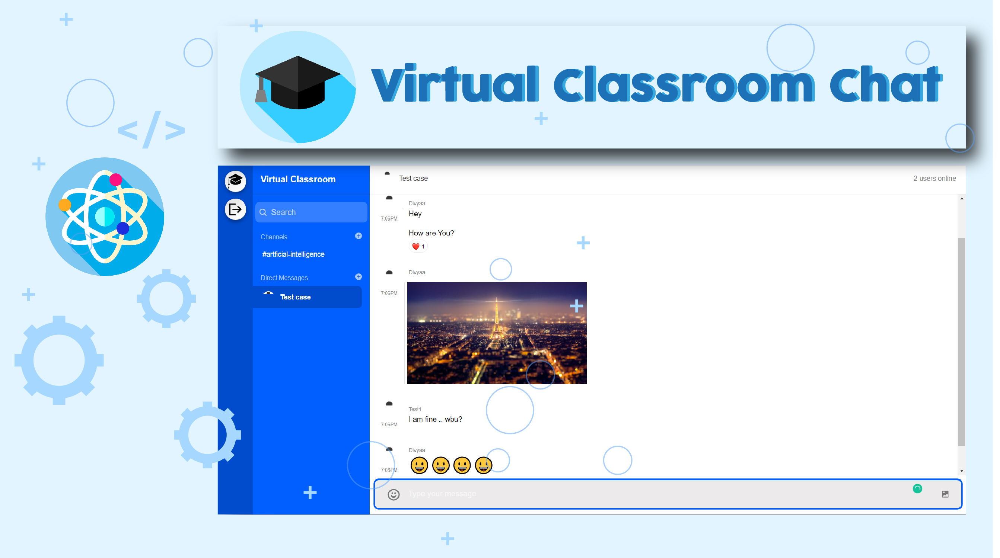

# Virtual Classroom Chat App
This is a Full Realtime Chat Application.
It allows you to built scalable and custom chat applications extremely easily.
We will use React for the front end, and NodeJS on the backend.
It contains stream-chat-react based inbuilt components.

It contains Direct Messages and Group Chat/Channels.
Chat feature includes:
Reaction to messages, Reply to messages in threads, Send Giphs, Upload video + picture, Embedded youtube video and upload documents.

### The Deployed Site is : https://virtual-classroom-project.netlify.app/

Stream (https://getstream.io/)

Setup: 
	run npm i && npm start for both client and server side to start the development server

### VS code Extensions
    ES7 React/Redux/GraphQL/React-Native snippets
	Better Comments

    
<!-- # Packages:

### Frontend
	stream-chat 
	stream-chat-react 
    universal-cookie
	axios

### Backend
	bcrypt 
	crypto (to create random cryprographic string)
	dotenv (for environment variables)
	express 
	getstream 
	stream-chat 
	nodemon 
	twilio (for sending live sms messages)
	Cors (for cross origin request)
 -->

<!-- test case
 username - sample1
 pw - test123 -->
